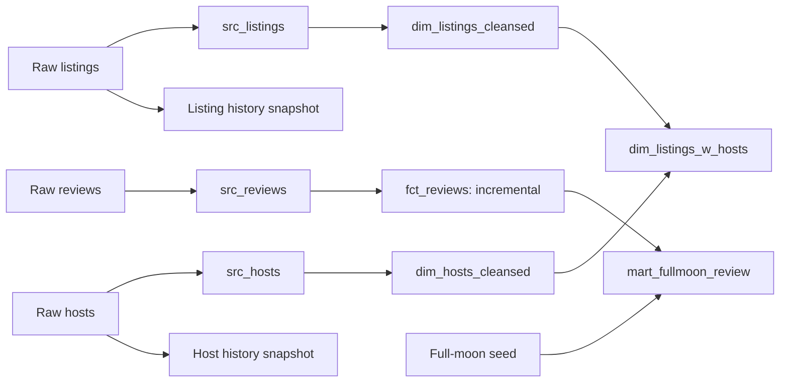

# Airbnb Analytics with dbt and Snowflake

Transform raw listings, hosts, and reviews into reusable dimensions, an incremental review fact table, and an exploratory review mart.

## Problem

Listing prices, host attributes, and review records need consistent types, identifiers, and relationships before they can support analysis. This project separates source mapping, cleanup, historical tracking, and analytical modeling in a versioned dbt project.

## Dataset / Source

The project expects three preloaded Snowflake tables in `AIRBNB.RAW`, also declared in [sources.yml](models/sources.yml):

| Table | Purpose |
|---|---|
| `RAW_LISTINGS` | Listing identifiers, names, room types, prices, host references, and timestamps |
| `RAW_HOSTS` | Host identifiers, names, superhost status, and timestamps |
| `RAW_REVIEWS` | Listing reviews, reviewer names, text, sentiment, and dates |

Raw data and ingestion scripts are not included. The repository does not document the original dataset release, location, or row counts; these should be recorded when reproducing the warehouse load. A [full-moon date seed](seeds/seed_full_moon_dates.csv) supports an exploratory calendar join.

## Tech Stack

- **Warehouse:** Snowflake
- **Transformation:** dbt Core and SQL/Jinja
- **Packages:** dbt_utils and dbt_expectations, declared in [packages.yml](packages.yml)
- **Validation:** dbt model tests and a source-freshness warning
- **History:** timestamp-based snapshots for raw hosts and listings

## Architecture / Workflow



## Models and Design Decisions

| Implementation | Responsibility |
|---|---|
| [Source models](models/src) | Map warehouse fields into consistent project names; configured as ephemeral models |
| [Listing cleanup](models/dim/dim_listings_cleansed.sql) | Convert dollar-denominated price strings to numeric values and replace zero minimum nights with one |
| [Host cleanup](models/dim/dim_hosts_cleansed.sql) | Standardize host attributes |
| [Listings with hosts](models/dim/dim_listings_w_hosts.sql) | Join cleaned listing and host information |
| [Review fact](models/fct/fct_reviews.sql) | Exclude null review text, generate surrogate review IDs, and load records newer than the existing maximum review date |
| [Snapshots](snapshots) | Track changes using source `updated_at` timestamps; invalidate hard-deleted records |
| [Calendar mart](models/mart/mart_fullmoon_review.sql) | Label reviews dated **one day after** a seeded full moon; the SQL label is `full moon` |

The calendar mart demonstrates a seeded date join. It does not establish that lunar phases affect reviews or sleep.

## Results / Hiring Evidence

The checked-in project contains **8 SQL models, 2 snapshot definitions, and 1 CSV seed**. [Schema tests](models/schema.yml) cover listing ID uniqueness and completeness, required host IDs, host relationships, and accepted room types. Reviews have a configured 12-hour freshness warning based on the source `date` field.

These are implementation facts, not claims of a successful current warehouse run. No measured performance, test pass count, or business impact is asserted here.

## How to Run

### 1. Prepare a clean environment

```bash
git clone https://github.com/LukeOpany/airbnb-dbt.git
cd airbnb-dbt
python3 -m venv .venv
source .venv/bin/activate
pip install 'dbt-snowflake>=1.10,<2'
dbt deps
```

Create a fresh environment rather than reusing the repository's checked-in `dbt_env` directory. The adapter range is a setup starting point; this documentation update has not validated a warehouse run with it.

### 2. Configure Snowflake

The source SQL currently hard-codes `AIRBNB.RAW`; use that database or update the source SQL to use dbt `source()` before choosing another database. Load the three raw tables and confirm their columns against [models/src](models/src). Configure an `airbnb` profile in `~/.dbt/profiles.yml` using a role with source-read and target-create permissions:

```yaml
airbnb:
  target: dev
  outputs:
    dev:
      type: snowflake
      account: "{{ env_var('SNOWFLAKE_ACCOUNT') }}"
      user: "{{ env_var('SNOWFLAKE_USER') }}"
      password: "{{ env_var('SNOWFLAKE_PASSWORD') }}"
      role: "{{ env_var('SNOWFLAKE_ROLE') }}"
      database: AIRBNB
      warehouse: "{{ env_var('SNOWFLAKE_WAREHOUSE') }}"
      schema: DBT_DEV
      threads: 4
```

Set those environment variables locally. Keep credentials outside the repository.

### 3. Build and inspect

```bash
dbt debug
dbt build
dbt source freshness
dbt docs generate
dbt docs serve
```

`dbt build` runs seeds, snapshots, models, and tests in dependency order. Historical static review data may trigger the freshness warning; it is not evidence of a broken transformation.

## What I Learned / Production Improvements

**Demonstrated now:** modular transformations, model-to-model lineage, mixed materializations, surrogate keys, timestamp snapshots, and declarative quality checks.

**Next improvements:**

- Replace hard-coded raw table references with `source()` so source lineage and database configuration stay consistent.
- Record the exact data release and add a repeatable ingestion script and dependency lock.
- Handle late-arriving reviews: the current strict maximum-date filter skips older arrivals and same-timestamp additions. Add a lookback and a merge key before using it for mutable production data.
- Validate price formats and expand review/host tests.
- Add automated checks, publish dbt docs, and capture a verified run summary.
- Remove tracked local environment files in a separate repository-cleanup change.
